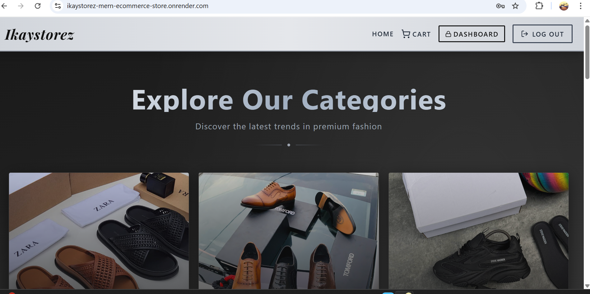

# 🛍️ IkayStorez — Men's Fashion E-Commerce Store



---

## Project Overview

**IkayStorez** is a full-stack e-commerce platform built with the **MERN stack** (MongoDB, Express.js, React, Node.js), focused on selling men's clothing and accessories.

The platform provides a smooth online shopping experience for customers while giving store administrators full control to manage products, orders, and inventory efficiently. Designed to be scalable, user-friendly, and modern — showcasing practical skills in full-stack web development.

---

##  Features

### Customer
- Browse products by category (Slides, Sneakers, Jeans, T-Shirts, Bags, and more)
- Add products to cart and manage quantities
- Secure checkout with **Paystack** (NGN & USD supported)
- Automatic currency detection based on location
- Coupon/gift card support
- Purchase success confirmation with confetti 🎉

###  Admin Dashboard
- Create, update, and delete products
- Upload product images via Cloudinary
- Upload category preview videos
- View analytics (sales, revenue, users)
- Toggle featured products

###  Global Payments
- Nigerian customers pay in **Naira (₦)** via Paystack
- International customers pay in **USD ($)** via Paystack
- Automatic IP-based currency detection

---

##  Technologies & Tools

| Layer | Technology |
|---|---|
| Frontend | React.js + Vite |
| Styling | Tailwind CSS |
| Backend | Node.js + Express.js |
| Database | MongoDB + Mongoose |
| Cache | Redis (Upstash) |
| Authentication | JWT (Access + Refresh tokens) |
| File Uploads | Cloudinary |
| Payments | Paystack |
| Animation | Framer Motion |
| State Management | Zustand |
| Version Control | Git & GitHub |

---

##  Getting Started

### Prerequisites
- Node.js v18+
- MongoDB Atlas account
- Upstash Redis account
- Cloudinary account
- Paystack account

### Installation

```bash
# Clone the repo
git clone https://github.com/yourusername/ikaystorez.git
cd ikaystorez

# Install backend dependencies
cd backend && npm install

# Install frontend dependencies
cd ../frontend && npm install
```

### Environment Variables

Create a `.env` file in the root folder:

```env
PORT=5000
NODE_ENV=development
MONGO_URI=your_mongodb_connection_string
UPSTASH_REDIS_URL=your_upstash_redis_url
ACCESS_TOKEN_SECRET=your_random_secret
REFRESH_TOKEN_SECRET=your_random_secret
CLOUDINARY_CLOUD_NAME=your_cloud_name
CLOUDINARY_API_KEY=your_api_key
CLOUDINARY_API_SECRET=your_api_secret
STRIPE_SECRET_KEY=sk_test_your_key
PAYSTACK_SECRET_KEY=sk_test_your_key
VITE_PAYSTACK_PUBLIC_KEY=pk_test_your_key
CLIENT_URL=https://ikaystorez-mern-ecommerce-store.onrender.com
```

### Running the App

```bash
# Run backend (from root folder)
cd backend && npm run dev

# Run frontend (in a new terminal)
cd frontend && npm run dev
```

Visit `http://localhost:5173` 🎉

---

##  Project Structure

```
ikaystorez/
├── backend/
│   ├── controllers/    # Route handlers
│   ├── models/         # Mongoose schemas
│   ├── routes/         # API routes
│   ├── middleware/      # Auth middleware
│   └── lib/            # Stripe, Paystack, Redis, Cloudinary
├── frontend/
│   ├── src/
│   │   ├── components/ # Reusable UI components
│   │   ├── pages/      # Page components
│   │   ├── stores/     # Zustand state management
│   │   └── lib/        # Axios instance
└── assets/             # Screenshots
```

---

##  Deployment

- **Frontend** → Cloudflare Pages
- **Backend** → Render.com
- **Database** → MongoDB Atlas
- **Cache** → Upstash Redis

---

## Author

**Ikenna Iwu**
- Instagram: [@ikaystorez](https://www.instagram.com/ikaystorez)
- WhatsApp: [+2348169366508](https://wa.me/2348169366508)

---

## 📄 License

This project is for personal and commercial use by IkayStorez. Est. 2019 🖤